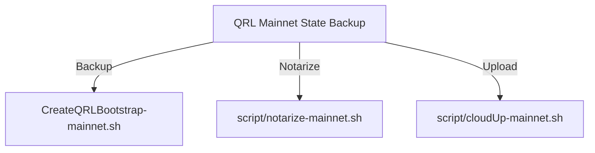
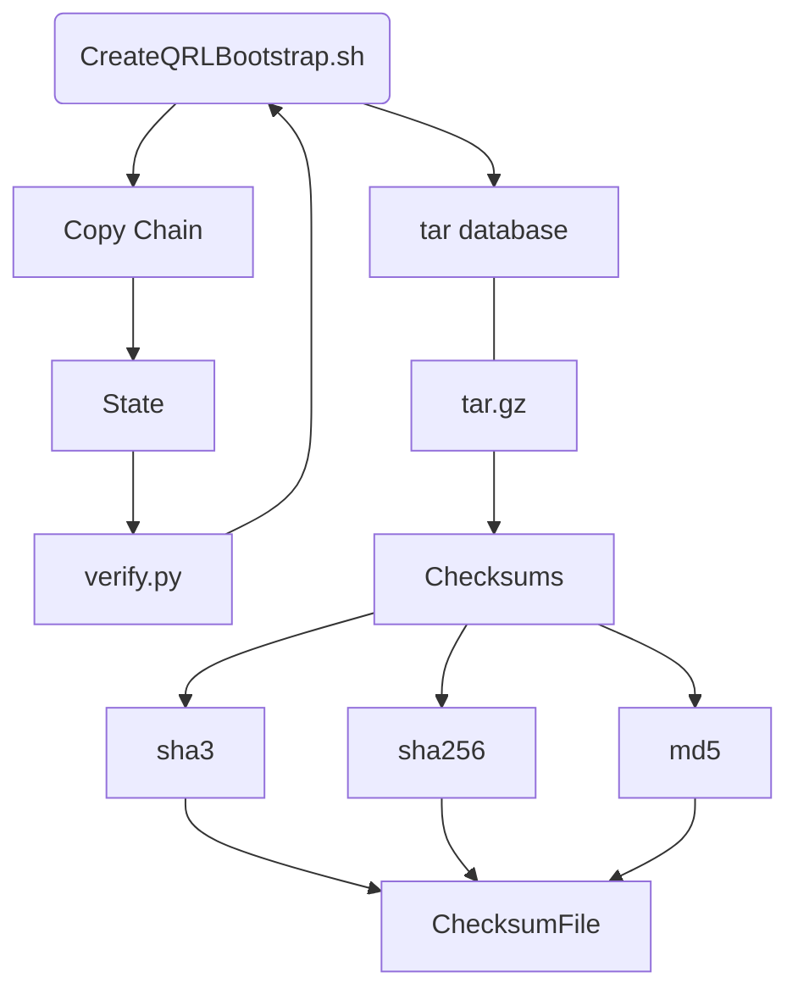
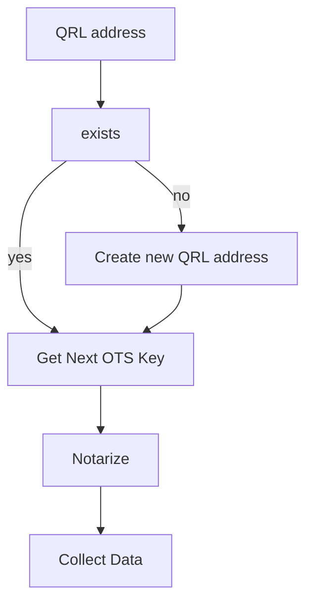
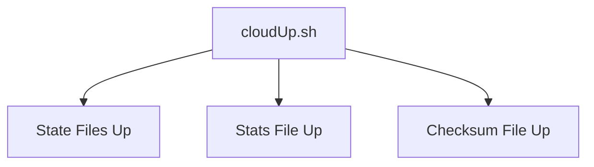

# qrl-chain-state-backup

[](https://www.codacy.com/gh/fr1t2/qrl-chain-state-backup/dashboard?utm_source=github.com&amp;utm_medium=referral&amp;utm_content=fr1t2/qrl-chain-state-backup&amp;utm_campaign=Badge_Grade)[](https://www.codacy.com/gh/fr1t2/qrl-chain-state-backup/dashboard?utm_source=github.com&amp;utm_medium=referral&amp;utm_content=fr1t2/qrl-chain-state-backup&amp;utm_campaign=Badge_Grade)


Backup blockchain state files to DigitalOcean spaces for serving through QRL.CO.IN for bootstrapping QRL nodes for faster spin-up and testing.  

The chain data is served from a link out of digital ocean https://cloud.digitalocean.com/spaces/qrl-chain and hosted on https://qrl.co.in/chain for the public to download.

Including the [QRL_bootstrap](https://github.com/0xFF0/QRL_bootstrap.git) sub-module for bootstrapping the QRL node and safely backing up the levelDB for the state.

## Setup

1. Clone the repo including submodules: `git clone --recurse-submodules https://github.com/fr1t2/qrl-chain-state-backup.git`

OR

1. Clone the repo: `git clone https://github.com/fr1t2/qrl-chain-state-backup.git`
2. Install the sub-module: `git submodule init`
3. Update the sub-module: `git submodule update`

### Confgiurations

Edit the configurations for each script to include any user or directory related changes throughout the scripts.

> Especially important is the $BACKUP_PATH in each file, this determines where the chain state will be copied to and zipped up from.

Ensure there is ample space to house these files as they grow in size. Mainnet is now `13GB`


### QRL Node

This script requires a fully synced node to be running in order to backup the state files. The scripts will look in the default directories for the qrl chain, `~/.qrl/` and `~/.qrl-testnet`. If you use a different location modify the scripts to fit.

Install the node following the [Official Instructions](https://docs.theqrl.org/node/QRLnode/)

#### QRL Node Service

Edit the node service files found in the `script/qrlnode-mainnet.service` and testnet services to suit your system. 

> Modify the service file to point to the correct directory for the node.

Install the service files on ubuntu using systemd:

```bash
sudo cp script/qrlnode-mainnet.service /etc/systemd/system/qrlnode-mainnet.service
sudo systemctl daemon-reload
sudo systemctl enable qrlnode-mainnet.service
sudo systemctl start qrlnode-mainnet.service
```

Check the node status with the qrl cli:


```bash
# mainnet
qrl state

info {
  version: "4.0.0 python"
  state: SYNCED
  num_connections: 62
  num_known_peers: 52
  uptime: 23645995
  block_height: 2474593
  block_last_hash: "4e2f78957f1655ed0dd0827669515b14a1d2afe38b746365a05f86db03000000"
  network_id: "The sleeper must awaken"
}

```

```bash
#testnet
qrl --port_pub 29009 state

info {
  version: "4.0.1 python"
  state: SYNCED
  num_connections: 3
  num_known_peers: 4
  uptime: 18058
  block_height: 55822
  block_last_hash: "e53c30238a9e2b0a0a877fb90d50f5135f78474256d7f4afcf0f59da106e2000"
  network_id: "Final Testnet"
}

```


### S3CMD

You will need to setup and authenticate with the DigitalOcean spaces API using the S3CMD program.

See this link to get started: 


### DigitalOcean Spaces

You will need to create a DigitalOcean account and setup a space to store the chain state files.

See this link to get started: https://docs.digitalocean.com/products/spaces/

> There are custom COORS settings that allow this to be served from the site without cross origin issues. See the settings in the digital ocean spaces dashboard for more.


## Usage

### backup-mainnet.sh

This script will backup the mainnet chain state to DigitalOcean spaces.

#### High level flow



<table>
<tr>
<td> CreateQRLBootstrap </td> <td> Notarize </td> <td> CloudUp </td>
</tr>
<tr>
<td> 



</td>
<td>



</td>
<td>



</td>

</tr>
</table>

## Endpoints 

### Mainnet -

| Origin | Edge | Subdomain |
| --- | --- | --- |
| [QRL_Mainnet_State.tar.gz](https://qrl-chain.fra1.digitaloceanspaces.com/mainnet/QRL_Mainnet_State.tar.gz) | [QRL_Mainnet_State.tar.gz](https://qrl-chain.fra1.cdn.digitaloceanspaces.com/mainnet/QRL_Mainnet_State.tar.gz) | [QRL_Mainnet_State.tar.gz](https://cdn.qrl.co.in/mainnet/QRL_Mainnet_State.tar.gz) |
| [Mainnet_State_Checksums.txt](https://qrl-chain.fra1.digitaloceanspaces.com/mainnet/Mainnet_State_Checksums.txt) | [Mainnet_State_Checksums.txt](https://qrl-chain.fra1.cdn.digitaloceanspaces.com/mainnet/Mainnet_State_Checksums.txt) | [Mainnet_State_Checksums.txt](https://cdn.qrl.co.in/mainnet/Mainnet_State_Checksums.txt) |
| [QRL_Node_Stats.json](https://qrl-chain.fra1.digitaloceanspaces.com/mainnet/QRL_Mainnet_State_Stats.json) | [QRL_Node_Stats.json](https://qrl-chain.fra1.cdn.digitaloceanspaces.com/mainnet/QRL_Mainnet_State_Stats.json) | [QRL_Node_Stats.json](https://cdn.qrl.co.in/mainnet/QRL_Mainnet_State_Stats.json) |

### Testnet -

| Origin | Edge | Subdomain |
| --- | --- | --- |
| [QRL_Testnet_State.tar.gz](https://qrl-chain.fra1.digitaloceanspaces.com/testnet/QRL_Testnet_State.tar.gz) | [QRL_Testnet_State.tar.gz](https://qrl-chain.fra1.cdn.digitaloceanspaces.com/testnet/QRL_Testnet_State.tar.gz) | [QRL_Testnet_State.tar.gz](https://cdn.qrl.co.in/testnet/QRL_Testnet_State.tar.gz) |
| [Testnet_State_Checksums.txt](https://qrl-chain.fra1.digitaloceanspaces.com/testnet/Testnet_State_Checksums.txt) | [Testnet_State_Checksums.txt](https://qrl-chain.fra1.cdn.digitaloceanspaces.com/testnet/Testnet_State_Checksums.txt) | [Testnet_State_Checksums.txt](https://cdn.qrl.co.in/testnet/Testnet_State_Checksums.txt) |
| [QRL_Testnet_State_Stats.json](https://qrl-chain.fra1.digitaloceanspaces.com/testnet/QRL_Testnet_State_Stats.json) | [QRL_Testnet_State_Stats.json](https://qrl-chain.fra1.cdn.digitaloceanspaces.com/testnet/QRL_Testnet_State_Stats.json) | [QRL_Testnet_State_Stats.json](https://cdn.qrl.co.in/testnet/QRL_Testnet_State_Stats.json) |


#### Crontab Entries

Using the combined script, compress, notarize and upload all of the files at once


 ```bash
#crontab entry to sync the chainstate

# “At minute 1 past every 6th hour.”
 1 */6 * * *    /home/fr1t2/qrl-chain-state-backup/backup-testnet.sh

# “At minute 15 past every 6th hour.”
15 */6 * * *     /home/fr1t2/qrl-chain-state-backup/backup-mainnet.sh
```
